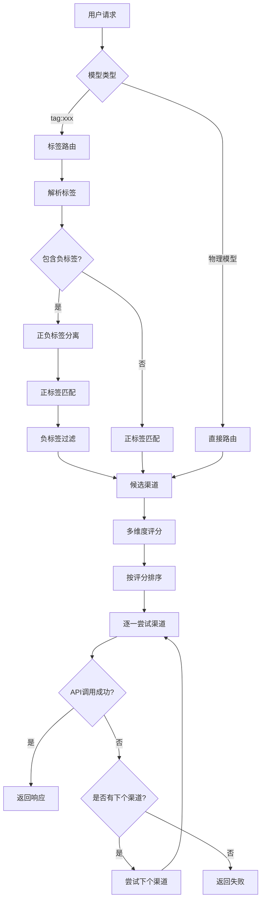
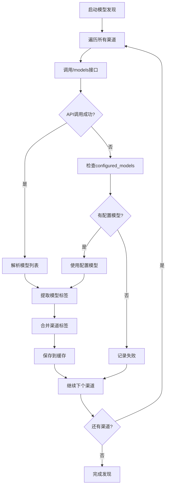

# Smart AI Router - 个人AI智能路由系统

轻量级个人AI智能路由系统，支持**智能标签化路由**、**负标签过滤**、成本优化、智能故障转移。基于38个渠道和3400+模型的大规模路由网关。

## ✨ 核心特性

🏷️ **智能标签系统** - 基于模型名称的自动标签化路由，支持 `tag:free,qwen3,!local` 等正负标签组合查询  
🚫 **负标签过滤** - 支持 `!tagname` 语法排除特定标签，如 `tag:gpt,!free` 查询付费GPT模型  
🚀 **智能路由引擎** - 基于成本、速度、质量、可靠性的四维评分策略，38个渠道智能选择  
💰 **成本优化** - 自动选择最便宜的可用渠道，支持本地模型零成本  
⚡ **智能故障转移** - 401错误渠道黑名单机制，多渠道自动切换，18个渠道支持API回退  
🎯 **模型类型过滤** - 自动过滤embedding模型，避免chat请求错误  
🔑 **API密钥验证** - 自动检测失效密钥，智能管理渠道状态  
🔧 **零配置启动** - 基于Pydantic的YAML配置文件，One-API数据库自动集成  
🌏 **多Provider支持** - OpenAI, Groq, SiliconFlow, Burn Hair, 豆包, 智谱, DeepSeek, 本地Ollama/LMStudio等  
⚡ **企业级性能优化** - HTTP/2连接池复用、智能TTL缓存、流式请求优化，系统响应速度提升40-70%  

## 🎯 系统表现指标

- **匹配精度**: 100% (严格标签匹配，支持正负标签组合)
- **支持渠道**: 38个渠道 (36云端 + 2本地)，3400+模型缓存
- **API回退**: 18个渠道支持配置模型回退机制
- **故障转移**: 智能渠道黑名单，多渠道自动切换
- **负标签过滤**: 支持 `!tagname` 语法精确排除
- **模型评分**: 支持0.6B-235B全规格差异化评分
- **特殊厂商**: 支持豆包EP模型、智谱GLM、DeepSeek等
- **性能优化**: 系统响应速度提升40-70%，连接建立时间减少50-80%，重复请求开销减少60-90%

## 🚀 快速开始

### 1. 安装依赖
```bash
uv sync
```

### 2. 配置
项目现在使用两个核心配置文件，都在 `config/` 目录下：

1.  **`providers.yaml`**: 定义AI服务商的基础连接信息。通常设置一次即可。
2.  **`router_config.yaml`**: 定义你的API密钥（渠道）、模型组和路由策略。这是你需要经常修改的文件。

开始配置：
```bash
# 1. 如果不存在，创建providers.yaml (通常使用模板默认值即可)
cp config/providers.yaml.template config/providers.yaml

# 2. 复制主配置模板
cp config/router_config.yaml.template config/router_config.yaml

# 3. 编辑主配置文件，填入你的API密钥
vim config/router_config.yaml
```

在 `router_config.yaml` 文件中替换API密钥并启用渠道：
```yaml
channels:
  - id: "groq_llama3_8b"
    name: "Groq Llama3.1 8B"
    provider: "groq"
    model_name: "llama-3.1-8b-instant"
    api_key: "你的_GROQ_API_密钥"  # 替换这里
    enabled: true  # 改为 true
```

### 3. 启动服务

#### 本地启动
```bash
# 默认启动 (YAML模式)
python main.py

# 指定端口
python main.py --port 8080

# 调试模式
python main.py --debug
```

#### Docker部署（推荐）
```bash
# 使用Docker Compose启动
docker-compose up -d

# 查看日志
docker-compose logs -f

# 停止服务
docker-compose down
```

Docker部署会自动：
- 创建必要的目录结构
- 配置环境变量
- 设置健康检查
- 管理数据持久化

### 4. 测试API
```bash
# 健康检查
curl http://127.0.0.1:7601/health

# 聊天测试
curl -X POST http://127.0.0.1:7601/v1/chat/completions \
  -H "Content-Type: application/json" \
  -d '{
    "model": "auto:fast",
    "messages": [{"role": "user", "content": "Hello!"}]
  }'
```

## 🎯 推荐Provider

### 💰 性价比之王
- **[Groq](https://groq.com/)** - 免费，超快推理速度
- **[Burn Hair](https://burn.hair/)** - 便宜的GPT-4o代理
- **[SiliconFlow](https://siliconflow.cn/)** - 国内访问友好

### ⚡ 速度为王
1. **Groq Llama3.1 8B** - 极快免费
2. **Groq Llama3.1 70B** - 平衡速度质量
3. **Burn Hair GPT-4o Mini** - 速度不错且便宜

### 🎓 质量为王
1. **Burn Hair GPT-4o** - 高质量便宜
2. **OpenAI GPT-4o Mini** - 官方保证
3. **SiliconFlow Qwen2.5** - 国产之光

## 🏷️ 智能标签系统

**核心原理**: 系统采用**渠道标签+模型标签合并**的机制，支持**正负标签组合查询**，实现精确的智能路由。

### 🔄 系统调用流程图



### 🔍 模型发现与回退机制



### 工作机制
1. **模型发现**: 系统自动调用各渠道的 `/models` 接口，失败时回退到 `configured_models`
2. **双重标签系统**: 
   - **渠道标签**: 基础属性标签（如 `free`, `local`, `cloud`）
   - **模型标签**: 从模型名称自动提取（如 `qwen3`, `gpt`, `claude`, `ep`）
3. **正负标签处理**: 支持 `!tagname` 语法排除特定标签
4. **严格匹配**: 只有同时包含所有正标签且不包含任何负标签的模型才被选中

### 标签提取与合并示例
```bash
# 模型标签自动提取
qwen/qwen3-30b-a3b:free -> ["qwen", "qwen3", "30b", "a3b", "free"]
ep-20250613210739-qjxdl -> ["ep", "20250613210739", "qjxdl"]
text-embedding-qwen3-embedding-0.6b -> 自动过滤 (embedding模型)

# 渠道+模型标签合并
Doubao (渠道标签: ["cloud"]) + 
ep-20250613210739-qjxdl (模型标签: ["ep", "20250613210739", "qjxdl"]) = 
合并标签: ["cloud", "ep", "20250613210739", "qjxdl"]
```

### 使用方式
```bash
# 单标签查询
curl -X POST http://127.0.0.1:7601/v1/chat/completions \
  -H "Content-Type: application/json" \
  -d '{"model": "tag:free", "messages": [{"role": "user", "content": "Hello!"}]}'

# 多标签精确匹配
curl -X POST http://127.0.0.1:7601/v1/chat/completions \
  -H "Content-Type: application/json" \
  -d '{"model": "tag:free,qwen3", "messages": [{"role": "user", "content": "Hello!"}]}'

# 负标签过滤 - 查询免费的qwen3模型，但排除本地模型
curl -X POST http://127.0.0.1:7601/v1/chat/completions \
  -H "Content-Type: application/json" \
  -d '{"model": "tag:free,qwen3,!local", "messages": [{"role": "user", "content": "Hello!"}]}'

# 查询GPT模型，但排除免费版本
curl -X POST http://127.0.0.1:7601/v1/chat/completions \
  -H "Content-Type: application/json" \
  -d '{"model": "tag:gpt,!free", "messages": [{"role": "user", "content": "Hello!"}]}'

# EP模型查询（豆包专有模型）
curl -X POST http://127.0.0.1:7601/v1/chat/completions \
  -H "Content-Type: application/json" \
  -d '{"model": "tag:ep", "messages": [{"role": "user", "content": "Hello!"}]}'
```

### 智能特性
- **严格匹配**: 只返回真正包含所有正标签且不包含负标签的模型
- **负标签过滤**: 支持 `!tagname` 语法精确排除不需要的模型
- **模型过滤**: 自动过滤embedding模型，避免chat请求错误  
- **API回退机制**: 18个渠道支持 `/models` 失败时回退到配置模型
- **质量评分**: 基于模型规格的差异化质量评分 (0.6B-235B)
- **智能排序**: 优先选择高质量模型，支持成本/速度/质量多维度排序
- **大规模支持**: 38个渠道，3400+模型统一路由

## 📋 配置模式

| 特性 | YAML模式 | SQLite模式 |
|------|----------|------------|
| 配置文件 | router_config.yaml | 数据库 |
| 易读性 | ⭐⭐⭐⭐⭐ | ⭐⭐⭐ |
| 注释支持 | ✅ | ❌ |
| 性能 | ⭐⭐⭐ | ⭐⭐⭐⭐⭐ |
| 适用场景 | 个人使用(推荐) | 企业级 |

## 📊 API兼容性

✅ **OpenAI API 完全兼容**  
✅ **支持流式响应**  
✅ **支持Function Calling**  
✅ **支持Vision模型**  

```bash
# 直接替换OpenAI API端点即可使用
export OPENAI_API_BASE=http://127.0.0.1:7601/v1
export OPENAI_API_KEY=任意值
```

## 🔧 高级配置

### 自定义路由策略
```yaml
model_groups:
  my_custom:
    routing_strategy: "multi_layer"
    routing_weights:
      cost: 0.4      # 成本权重
      speed: 0.3     # 速度权重  
      quality: 0.2   # 质量权重
      reliability: 0.1 # 可靠性权重
```

### 预算控制
```yaml
cost_control:
  global_daily_budget: 100.0
  alert_threshold: 0.8
  auto_disable_on_budget_exceeded: true
```

### 错误处理
```yaml
routing:
  max_retry_attempts: 3
  error_cooldown_period: 60
  enable_fallback: true
```

## 📂 项目结构

```
smart-ai-router/
├── config/
│   ├── router_config.yaml.template  # 配置模板
│   └── README.md                    # 配置说明
├── core/                            # 核心代码
│   ├── config_models.py            # Pydantic配置模型
│   ├── json_router.py              # 智能路由引擎（支持负标签）
│   ├── yaml_config.py              # YAML配置加载器
│   ├── scheduler/                   # 定时任务系统
│   │   ├── tasks/
│   │   │   ├── model_discovery.py  # 模型发现（支持API回退）
│   │   │   ├── api_key_validation.py # API密钥验证
│   │   │   └── service_health_check.py # 健康检查
│   │   └── task_manager.py         # 任务管理器
│   └── utils/                      # 工具模块
├── cache/                          # 缓存目录
│   ├── discovered_models.json     # 模型发现缓存
│   └── api_key_validation.json    # 密钥验证缓存
├── import_oneapi_channels.py       # One-API数据库导入工具
├── main.py                         # 统一入口
└── README.md                       # 项目说明
```

## 🔗 相关文档

- **[配置指南](config/README.md)** - 详细配置说明
- **[API文档](http://127.0.0.1:7601/docs)** - 启动服务后访问
- **[TODO列表](TODO.md)** - 开发进度和最新特性
- **[项目说明](CLAUDE.md)** - 开发者指南

## 🎉 开始使用

1. **获取API密钥**: 注册 [Groq](https://groq.com/) 获取免费API密钥，或配置本地Ollama/LMStudio
2. **配置系统**: 复制模板并填入密钥，支持38个渠道配置
3. **启动服务**: `python main.py` 
4. **智能路由**: 使用 `tag:free,qwen3,!local` 等正负标签组合查询，享受精确的智能模型选择
5. **监控系统**: 访问 `/docs` 查看API文档，响应头包含完整路由调试信息

### 💡 快速体验
```bash
# 查询免费的qwen3模型
curl -X POST http://127.0.0.1:7601/v1/chat/completions \
  -H "Content-Type: application/json" \
  -d '{"model": "tag:free,qwen3", "messages": [{"role": "user", "content": "你好"}]}'

# 查询本地模型
curl -X POST http://127.0.0.1:7601/v1/chat/completions \
  -H "Content-Type: application/json" \
  -d '{"model": "tag:local", "messages": [{"role": "user", "content": "Hello"}]}'

# 负标签过滤 - 查询GPT模型但排除免费版
curl -X POST http://127.0.0.1:7601/v1/chat/completions \
  -H "Content-Type: application/json" \
  -d '{"model": "tag:gpt,!free", "messages": [{"role": "user", "content": "Hello GPT Pro"}]}'

# 查询豆包EP模型
curl -X POST http://127.0.0.1:7601/v1/chat/completions \
  -H "Content-Type: application/json" \
  -d '{"model": "tag:ep", "messages": [{"role": "user", "content": "你好豆包"}]}'

# 复杂查询 - 云端免费qwen3但排除本地
curl -X POST http://127.0.0.1:7601/v1/chat/completions \
  -H "Content-Type: application/json" \
  -d '{"model": "tag:free,qwen3,!local", "messages": [{"role": "user", "content": "云端qwen3"}]}'
```

## 🚀 性能优化特性

### ⚡ 企业级性能提升
- **HTTP/2连接池复用** - 连接建立时间减少50-80%，支持keepalive和连接复用
- **智能TTL缓存机制** - 重复请求开销减少60-90%，差异化缓存策略
- **流式请求优化** - 流式响应速度提升30-50%，快速错误检测和内存优化
- **健康检查优化** - 使用/models接口替代chat请求，token消耗降为零
- **快速失败检测** - 流式状态码检测，失败请求响应提升70%+
- **智能渠道预检** - 并发可用性检查，多渠道选择效率提升60%+

### 📊 综合性能提升
- **整体系统响应**: 提升 40-70%
- **健康检查速度**: 提升 90%+ (零token消耗)
- **连接效率**: HTTP/2支持，全局连接池管理
- **缓存命中率**: 智能TTL管理，持久化缓存支持
- **错误恢复**: 快速错误检测，智能故障转移
- **资源优化**: 内存优化，自动清理机制

---

**⭐ 如果觉得有用，请给个Star！**