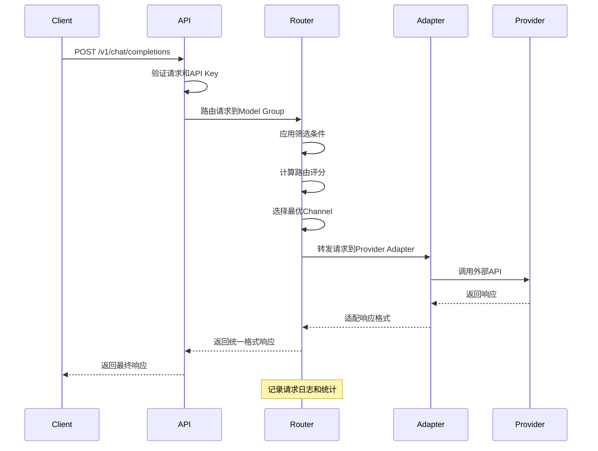
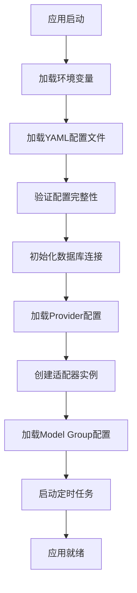
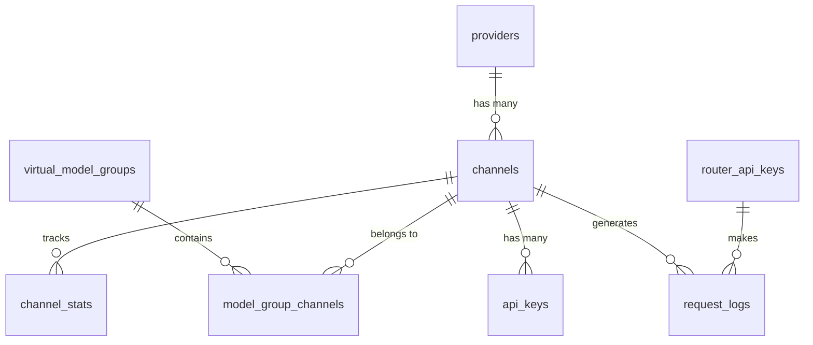

# 系统架构设计

## 整体架构

Smart AI Router 采用分层架构设计，实现Provider/Channel/Model Group三层抽象。

```
┌─────────────────────────────────────────────────────────┐
│                    Client Applications                  │
└─────────────────────────────────────────────────────────┘
                            ▲
                            │ OpenAI Compatible API
                            ▼
┌─────────────────────────────────────────────────────────┐
│                     API Gateway Layer                   │
│  ┌─────────────┐ ┌─────────────┐ ┌─────────────────────┐│
│  │    Chat     │ │   Models    │ │    Management       ││
│  │     API     │ │     API     │ │       API           ││
│  └─────────────┘ └─────────────┘ └─────────────────────┘│
└─────────────────────────────────────────────────────────┘
                            ▲
                            │
                            ▼
┌─────────────────────────────────────────────────────────┐
│                 Smart Routing Engine                     │
│  ┌─────────────┐ ┌─────────────┐ ┌─────────────────────┐│
│  │   Model     │ │  Routing    │ │   Capability        ││
│  │   Group     │ │ Strategies  │ │    Filters          ││
│  │  Manager    │ │             │ │                     ││
│  └─────────────┘ └─────────────┘ └─────────────────────┘│
└─────────────────────────────────────────────────────────┘
                            ▲
                            │
                            ▼
┌─────────────────────────────────────────────────────────┐
│                 Provider Adapter Layer                  │
│  ┌────────────┐ ┌────────────┐ ┌────────────┐ ┌───────┐│
│  │   OpenAI   │ │ Anthropic  │ │    Groq    │ │  ...  ││
│  │  Adapter   │ │  Adapter   │ │  Adapter   │ │       ││
│  └────────────┘ └────────────┘ └────────────┘ └───────┘│
└─────────────────────────────────────────────────────────┘
                            ▲
                            │
                            ▼
┌─────────────────────────────────────────────────────────┐
│                External AI Services                     │
│  ┌────────────┐ ┌────────────┐ ┌────────────┐ ┌───────┐│
│  │   OpenAI   │ │ Anthropic  │ │    Groq    │ │  ...  ││
│  │    API     │ │    API     │ │    API     │ │       ││
│  └────────────┘ └────────────┘ └────────────┘ └───────┘│
└─────────────────────────────────────────────────────────┘
```

## 核心组件

### 1. API网关层
- **Chat API**: OpenAI兼容的聊天接口
- **Models API**: 模型组列表接口
- **Management API**: 动态配置管理接口
- **Health API**: 健康检查和监控接口

### 2. 智能路由引擎
- **Model Group Manager**: 模型组管理和路由决策
- **Routing Strategies**: 多种路由策略实现
- **Capability Filters**: 基于能力的模型筛选

### 3. Provider适配器层
- **BaseAdapter**: 通用适配器基类
- **具体适配器**: 各Provider的具体实现
- **协议转换**: 统一接口到具体Provider协议的转换

## 数据流设计

### 请求处理流程



### 配置加载流程



## 数据存储架构

### 数据库表关系



### 配置管理策略

- **静态配置**: YAML文件，系统级设置
- **动态配置**: 数据库存储，运行时可变
- **缓存策略**: Redis缓存热点数据
- **配置同步**: 实时配置变更通知

## 路由决策算法

### 多层路由策略

```python
def calculate_routing_score(channel, request, strategy):
    """
    计算渠道路由评分
    
    评分 = Σ(权重i × 因子评分i)
    
    因子包括:
    - effective_cost: 有效成本 (考虑价格倍率)
    - speed_score: 速度评分 (基于历史延迟)
    - reliability_score: 可靠性评分 (基于成功率)
    - quota_remaining: 剩余配额比例
    - health_score: 健康状态评分
    """
    total_score = 0
    for factor in strategy.routing_strategy:
        factor_score = get_factor_score(channel, factor.field)
        weighted_score = factor_score * factor.weight
        total_score += weighted_score
    
    return total_score
```

### 能力筛选机制

```python
def filter_by_capabilities(channels, required_capabilities):
    """
    基于能力要求筛选渠道
    
    支持的能力类型:
    - function_calling: 工具调用
    - vision: 视觉理解
    - code_generation: 代码生成
    - multimodal: 多模态处理
    - streaming: 流式输出
    """
    filtered_channels = []
    for channel in channels:
        if all(has_capability(channel, cap) for cap in required_capabilities):
            filtered_channels.append(channel)
    
    return filtered_channels
```

## 故障处理机制

### 错误分类和处理

```python
ERROR_CLASSIFICATIONS = {
    'permanent': [
        'invalid_api_key',
        'insufficient_quota', 
        'model_not_found'
    ],
    'temporary': [
        'rate_limit_exceeded',
        'server_error',
        'timeout'
    ],
    'retryable': [
        'network_error',
        'connection_timeout',
        'service_unavailable'
    ]
}
```

### Circuit Breaker模式

```python
class CircuitBreaker:
    def __init__(self, failure_threshold=5, recovery_timeout=300):
        self.failure_threshold = failure_threshold
        self.recovery_timeout = recovery_timeout
        self.failure_count = 0
        self.last_failure_time = None
        self.state = 'CLOSED'  # CLOSED, OPEN, HALF_OPEN
    
    async def call(self, func, *args, **kwargs):
        if self.state == 'OPEN':
            if self.should_attempt_reset():
                self.state = 'HALF_OPEN'
            else:
                raise CircuitBreakerOpenError()
        
        try:
            result = await func(*args, **kwargs)
            self.on_success()
            return result
        except Exception as e:
            self.on_failure()
            raise
```

## 监控和可观测性

### 指标收集

- **请求指标**: QPS、延迟、成功率
- **成本指标**: 单请求成本、总成本、预算使用率
- **渠道指标**: 健康状态、配额使用、错误率
- **系统指标**: CPU、内存、数据库连接

### 日志结构

```json
{
  "timestamp": "2024-01-01T00:00:00Z",
  "level": "INFO",
  "logger": "core.router",
  "request_id": "req_123456",
  "model_group": "auto:free",
  "selected_channel": "groq_llama_8b",
  "routing_scores": {
    "groq_llama_8b": 0.95,
    "openrouter_free": 0.87
  },
  "latency_ms": 250,
  "cost": 0.0,
  "tokens": {
    "prompt": 15,
    "completion": 32,
    "total": 47
  }
}
```

## 扩展性设计

### 水平扩展

- **无状态设计**: API服务可水平扩展
- **数据库读写分离**: 支持读副本扩展
- **缓存分片**: Redis Cluster支持
- **负载均衡**: 支持多实例部署

### 垂直扩展

- **Provider扩展**: 插件化适配器架构
- **路由策略扩展**: 策略模式设计
- **能力扩展**: 动态能力注册
- **监控扩展**: 可插拔监控后端

## 安全设计

### 认证和授权

- **API Key认证**: 基于哈希的密钥验证
- **权限控制**: 基于角色的访问控制(RBAC)
- **请求限制**: 基于用户和IP的速率限制
- **审计日志**: 完整的请求审计记录

### 数据保护

- **API密钥加密**: 静态数据加密存储
- **传输加密**: HTTPS/TLS传输保护
- **日志脱敏**: 敏感信息自动脱敏
- **配置安全**: 敏感配置环境变量隔离